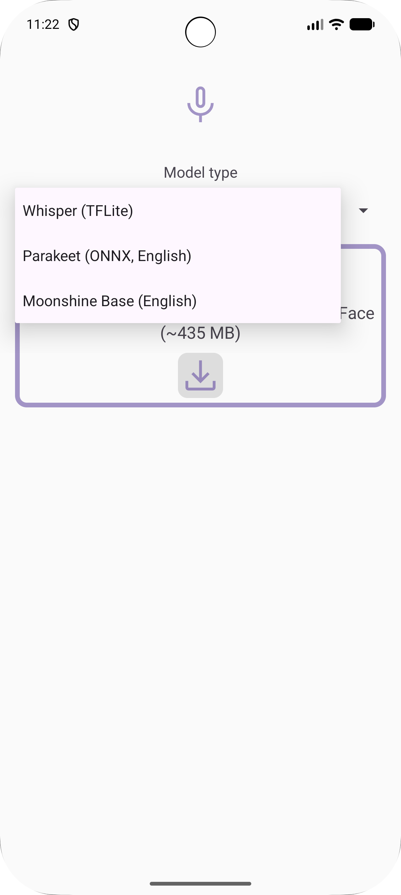
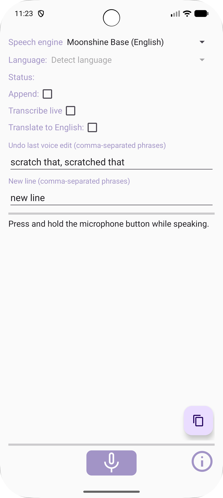

> Google has announced that, starting in 2026/2027, all apps on certified Android devices will require the developer to submit personal identity details directly to Google. Since the developers of this app do not agree to this requirement, this app will no longer work on certified Android devices after that time.

# SpeechToText — voice recognition (Whisper, Parakeet, Moonshine)

**SpeechToText** (`org.speechtotext.input`) is an input method editor (IME) with on-device speech recognition. Use it as a **standalone app** (settings + microphone on the main screen) or as an **IME** (e.g. microphone button in [HeliBoard](https://f-droid.org/packages/helium314.keyboard/)). It can also be selected as system-wide **voice input** (`RecognitionService`) and supports `RecognizerIntent.ACTION_RECOGNIZE_SPEECH`.

Choose one of three engines (same choice applies across IME, standalone, and voice input where applicable):

| Engine | Notes |
|--------|--------|
| **Whisper** (TFLite) | Multilingual models; in the standalone app you can **translate** recognized speech to English. With **Transcribe live**, partial text updates while you hold (throttled on-device decode). |
| **Parakeet** (ONNX) | English; **live** streaming partial transcripts while you hold the button. |
| **Moonshine Base** | English on-device model; **live** streaming partials while you hold. |

On first use, the app **downloads** the models for the engine you pick (Whisper from Hugging Face is a large download). Internet is required for downloads; after that, recognition runs on the device.

## Screenshots

**Main screen — engine and model**

Pick Whisper, Parakeet, or Moonshine; download progress appears when models are missing.

**Options and voice commands**

Use **Append** to keep adding text across recordings, **Transcribe live** for partial results while holding the button (all three engines; Whisper uses periodic on-device previews), and **Translate to English** with Whisper in the standalone app. Configure comma-separated phrases for **Undo last voice edit** (reverts recent voice-driven text, with sentence fallback) and **New line**.

**Store / F-Droid previews**

 

## Initial setup

For **voice input** (not the IME), use Android settings (**System → Languages → Speech → Voice input**), enable this app, then open its settings to pick the engine and model.

If SpeechToText does not appear as voice input (only Google/Samsung, etc.):

- enable USB debugging
- run (release / F-Droid package `org.speechtotext.input`):  
  `adb shell settings put secure voice_recognition_service org.speechtotext.input/com.whispertflite.WhisperRecognitionService`
- run (**debug** build from Android Studio / `./gradlew assembleDebug`, package `org.speechtotext.input.debug`):  
  `adb shell settings put secure voice_recognition_service org.speechtotext.input.debug/com.whispertflite.WhisperRecognitionService`

Debug and release install as **separate apps** so local development does not replace the store build.

## Using SpeechToText

- Press and **hold** the microphone button while speaking (or watch **live** partial text where enabled).
- Pause briefly before you start speaking.
- Speak clearly, at a moderate pace.
- Hold-to-talk is limited to about **60 seconds** per recording.

## Donate

<pre>Send a coffee to 
woheller69@t-online.de 

  
Or via this link (with fees)
</pre>

## Contribute

For translations use https://toolate.othing.xyz/projects/whisperime/

# License

This work is licensed under MIT license, © woheller69

- This app is based on the [Whisper-Android project](https://github.com/vilassn/whisper_android), published under MIT license
- It uses [OpenAI Whisper](https://github.com/openai/whisper) published under MIT license. Details on Whisper are found [here](https://arxiv.org/abs/2212.04356).
- It uses [Android VAD](https://github.com/gkonovalov/android-vad), which is published under MIT license
- It uses [Opencc4j](https://github.com/houbb/opencc4j), for Chinese conversions, published under Apache-2.0 license
- At first start it downloads the Whisper TFLite models from [Hugging Face](https://huggingface.co/DocWolle/whisper_tflite_models), which is published under MIT license

# OTHER APPS

| **RadarWeather** | **Gas Prices** | **Smart Eggtimer** |
|:---:|:---:|:--:|
|  |  |  |
| **Bubble** | **hEARtest** | **GPS Cockpit** |
|  |  |  |
| **Audio Analyzer** | **LavSeeker** | **TimeLapseCam** |
|  | |  |
| **Arity** | **Cirrus** | **solXpect** |
|  |  |  |
| **gptAssist** | **dumpSeeker** | **huggingAssist** |
|  |  |  |
| **FREE Browser** | **whoBIRD** | **PeakOrama** |
|  |  |  |
| **SpeechToText** | **Seamless** | **SherpaTTS** |
|  |  |  |
